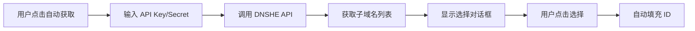

# 自动获取子域名 ID 功能

## 🎯 功能说明

Web 后台新增了**自动获取子域名 ID**功能，无需手动查找和填写 Subdomain ID。

## ✨ 使用方法

### 1. 填写 API 凭证
在 Web 后台配置管理中填写：
- **API Key**
- **API Secret**

### 2. 点击"自动获取"按钮
在"域名 ID (Subdomain ID)"输入框旁边，点击 **🔍 自动获取** 按钮

### 3. 选择子域名
系统会自动调用 DNSHE API 获取你的所有子域名，并显示在选择对话框中：

| 选择 | 子域名 | 根域名 | 完整域名 | 状态 |
|------|--------|--------|----------|------|
| ⬤ | gudu.bbroot.com | bbroot.com | gudu.bbroot.com | active |

点击任意一行即可自动填充对应的 **Subdomain ID**

### 4. 保存配置
点击"💾 保存配置"按钮完成设置

## 🔧 技术实现

### API接口
```
POST /api/auto_fetch_subdomains
```

### 请求参数
```json
{
  "api_key": "cfsd_xxxxxxxxxx",
  "api_secret": "yyyyyyyyyyyy"
}
```

### 返回格式
```json
{
  "success": true,
  "message": "成功获取 1 个子域名",
  "subdomains": [
    {
      "id": 229726,
      "name": "gudu.bbroot.com",
      "rootdomain": "bbroot.com",
      "full_domain": "gudu.bbroot.com",
      "status": "active"
    }
  ]
}
```

## 💡 优势

- ✅ **简化配置** - 无需登录 DNSHE 官网查找 ID
- ✅ **实时更新** - 获取最新的子域名列表
- ✅ **一键选择** - 点击即可自动填充
- ✅ **减少错误** - 避免手动输入错误

## 🔍 调用流程



## 📝 注意事项

1. 确保 API Key 和 API Secret 正确
2. 确保网络连接正常
3. 如果没有子域名，需要先在 DNSHE 官网创建
4. 该功能不会修改任何配置，只是获取信息

---

更新时间：2026-03-11
